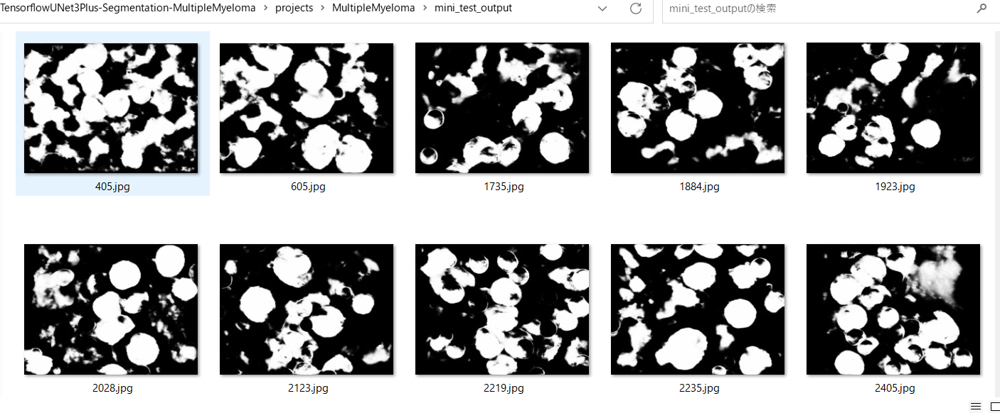
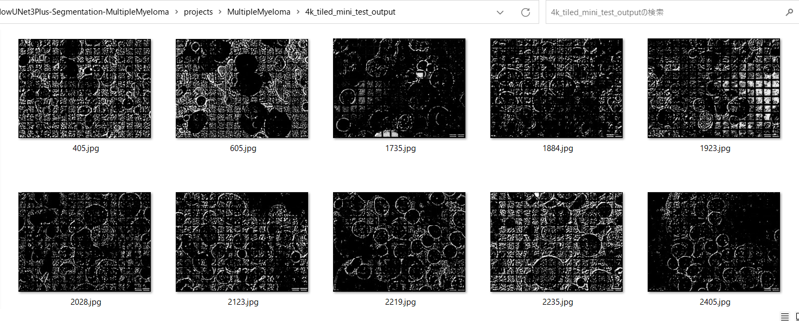

<h2>
TensorflowUNet3Plus-Segmentation-MultipleMyeloma (Updated: 2023/06/30)
</h2>
This is an experimental project to detect <b>MultipleMyeloma</b> 
by using <a href="./TensorflowUNet3Plus.py">TensorflowUNet3Plus</a> Model,
which is a slightly modified version based on <b>unet3plus.py</b> in the following repository. 

<b>UNet 3+: A Full-Scale Connected UNet for Medical Image Segmentation</b> 
<pre>
https://github.com/hamidriasat/UNet-3-Plus/blob/unet3p_lits/models/unet3plus.py
</pre>
On UNet 3+, please refer to the following paper: 
<b>3. UNet 3+: A Full-Scale Connected UNet for Medical Image Segmentation</b> 
<pre>
https://arxiv.org/ftp/arxiv/papers/2004/2004.08790.pdf
</pre>

Please see also: 
<a href="https://github.com/atlan-antillia/Image-Segmentation-MultipleMyeloma">Image-Segmentation-MultipleMyeloma</a>
 

The original dataset used here has been take from the following  web site:  
<b>SegPC-2021-dataset</b> 
SegPC-2021: Segmentation of Multiple Myeloma Plasma Cells in Microscopic Images 
<pre>
https://www.kaggle.com/datasets/sbilab/segpc2021dataset
</pre>
Citation: 
<pre>
Anubha Gupta, Ritu Gupta, Shiv Gehlot, Shubham Goswami, April 29, 2021, "SegPC-2021: Segmentation of Multiple Myeloma Plasma Cells 
in Microscopic Images", IEEE Dataport, doi: https://dx.doi.org/10.21227/7np1-2q42.
BibTex
@data{segpc2021,
doi = {10.21227/7np1-2q42},
url = {https://dx.doi.org/10.21227/7np1-2q42},
author = {Anubha Gupta; Ritu Gupta; Shiv Gehlot; Shubham Goswami },
publisher = {IEEE Dataport},
title = {SegPC-2021: Segmentation of Multiple Myeloma Plasma Cells in Microscopic Images},
year = {2021} }
IMPORTANT:
If you use this dataset, please cite below publications-
1. Anubha Gupta, Rahul Duggal, Shiv Gehlot, Ritu Gupta, Anvit Mangal, Lalit Kumar, Nisarg Thakkar, and Devprakash Satpathy, 
 "GCTI-SN: Geometry-Inspired Chemical and Tissue Invariant Stain Normalization of Microscopic Medical Images," 
 Medical Image Analysis, vol. 65, Oct 2020. DOI: 
 (2020 IF: 11.148)
2. Shiv Gehlot, Anubha Gupta and Ritu Gupta, 
 "EDNFC-Net: Convolutional Neural Network with Nested Feature Concatenation for Nuclei-Instance Segmentation,"
 ICASSP 2020 - 2020 IEEE International Conference on Acoustics, Speech and Signal Processing (ICASSP), 
 Barcelona, Spain, 2020, pp. 1389-1393.
3. Anubha Gupta, Pramit Mallick, Ojaswa Sharma, Ritu Gupta, and Rahul Duggal, 
 "PCSeg: Color model driven probabilistic multiphase level set based tool for plasma cell segmentation in multiple myeloma," 
 PLoS ONE 13(12): e0207908, Dec 2018. DOI: 10.1371/journal.pone.0207908
License
CC BY-NC-SA 4.0
</pre>

<h2>
2 Prepare dataset
</h2>

<h2>
2. Install TensorflowUNet3Plu-Segmentation-MultipleMyeloma
</h2>
<h3>2.1 Clone repository</h3>
Please clone TensorflowUNet3Plus-Segmentation-MultipleMyeloma in the working folder <b>c:\google</b>. 
<pre>
>git clone https://github.com/sarah-antillia/TensorflowUNet3Plus-Segmentation-MultipleMyeloma.git 
</pre>
You can see the following folder structure in TensorflowUNet3Plus-Segmentation-MultipleMyeloma of the working folder. 

<pre>
TensorflowUNet3Plus-Segmentation-MultipleMyeloma
├─asset
└─projects
    └─MultipleMyeloma
        ├─4k_mini_test
        ├─4k_tiled_mini_test_output
        ├─eval
        ├─generator
        ├─mini_test
        ├─mini_test_output
        ├─models
        └─MultipleMyeloma
            ├─train
            │  ├─images
            │  └─masks
            └─valid
                ├─images
                └─masks
</pre>
<h3>2.2 Install Python packages</h3>

Please run the following command to install python packages for this project. 
<pre>
>cd ./TensorflowUNet3Plus-Segmentation-MultipleMyeloma
>pip install -r requirements.txt
</pre>

 
<h3>2.3 Create MultipleMyeloma dataset</h3>
<h3>
2.3.1. Download 
</h3>
Please download original <b>Multiple Myeloma Plasma Cells</b> dataset from the following link.
<b>SegPC-2021-dataset</b> 
SegPC-2021: Segmentation of Multiple Myeloma Plasma Cells in Microscopic Images 
<pre>
https://www.kaggle.com/datasets/sbilab/segpc2021dataset
</pre>
The folder structure of the dataset is the following. 
<pre>
TCIA_SegPC_dataset
├─test
│  └─x
├─train
│  ├─x
│  └─y
└─valid
    ├─x
    └─y
</pre>
Each <b>x</b> folder of the dataset contains the ordinary image files of Multiple Myeloma Plasma Cells,
and <b>y</b> folder contains the mask files to identify each Cell of the ordinary image files.
  Both the image size of all files in <b>x</b> and <b>y</b> is 2560x1920 (2.5K), which is apparently too large to use 
for our TensoflowUNet Model. 

Sample images in train/x: 
 
Sample masks in train/y: 
 

<h3>
2.3.2. Generate MultipleMyeloma Image Dataset
</h3>
 We have created Python script <a href="./projects/MultipleMyeloma/generator/MultipleMyelomaImageDatasetGenerator.py">
 <b>/projects/MultipleMyeloma/generator/MultipleMyelomaImageDatasetGenerator.py</b></a> to create images and masks dataset. 
 This script will perform following image processing. 
 <pre>
 1 Resize all bmp files in <b>x</b> and <b>y</b> folder to 256x256 square image.
 2 Create clear white-black mask files from the original mask files.
 3 Create cropped images files corresponding to each segmented region in mask files in <b>y</b> folders.
</pre>

See also the following web-site on Generation of MultipleMyeloma Image Dataset. 
<a href="https://github.com/atlan-antillia/Image-Segmentation-Multiple-Myeloma">Image-Segmentation-Multiple-Myeloma </a>
 

<h3>
2.3.3 Generated MultipleMyeloma dataset. 
</h3>
Finally, we have generated the resized jpg files dataset below.  
<pre>
└─projects
    └─MultipleMyeloma
        └─MultipleMyeloma
            ├─train
            │  ├─images
            │  └─masks
            └─valid
                ├─images
                └─masks
</pre>

<h3>
3 TensorflowUNet3Plus class
</h3>
We have defined <a href="./TensorflowUNet3Plus.py">TensorflowUNet3Plus</a> class as a subclass of <a href="./TensorflowUNet.py">TensorflowUNet</a> class. A <b>create</b> method in that class has been taken from 
<a href="https://github.com/hamidriasat/UNet-3-Plus/blob/unet3p_lits/models/unet3plus.py">unet3plus.py</a>
 and 
<a href="https://github.com/hamidriasat/UNet-3-Plus/blob/unet3p_lits/models/unet3plus_utils.py">unet3plus_utils.py</a>
 
in the following repository: 
<a href="https://github.com/hamidriasat/UNet-3-Plus"><b>UNet 3+: A Full-Scale Connected UNet for Medical Image Segmentation</b>
</a> 

<h3>3.1 Dropout to conv_block</h3>
We have added <b>Dropout</b> layers to the original <b>conv_block</b> function as shown below. 
<pre>
  #The following method has been taken from 
  # https://github.com/hamidriasat/UNet-3-Plus/blob/unet3p_lits/models/unet3plus_utils.py
  def conv_block(self, x, kernels, kernel_size=(3, 3), strides=(1, 1), padding='same',
               is_bn=True, is_relu=True, n=2):
    for i in range(1, n + 1):
        x = k.layers.Conv2D(filters=kernels, kernel_size=kernel_size,
                            padding=padding, strides=strides,
                            kernel_regularizer=tf.keras.regularizers.l2(1e-4),
                            kernel_initializer=k.initializers.he_normal(seed=5))(x)
        #2023/06/30
        #<experiment>
        x = Dropout(self.dropout_rate * i)(x)
        #</experiment>
        
        if is_bn:
            x = k.layers.BatchNormalization()(x)
        if is_relu:
            x = k.activations.relu(x)

    return x
</pre>

<h3>3.2 Filter sizes</h3>
We have also modified the original filters 
<pre>
    """ UNet3+ base model """
    filters = [64, 128, 256, 512, 1024]
</pre>
in 
<a href="https://github.com/hamidriasat/UNet-3-Plus/blob/unet3p_lits/models/unet3plus.py">unet3plus.py</a>
 to be less size filters as shown below. In this case, a default base_filters is 16, which helps
to avoid memory allocation error. 
<pre>
  def create(self, num_classes, image_height, image_width, image_channels,
            base_filters = 16, num_layers = 5):
    self.dropout_rate = self.config.get(MODEL, "dropout_rate")
    output_channels = 1
    #input_shape, output_channels
    input_shape = (image_width, image_height, image_channels)
    num_filters = 5
    """ UNet3+ base model """
    #filters = [64, 128, 256, 512, 1024]
    filters = []
    for i in range(num_filters):
      filters.append(base_filters * (2**i))
    print("--- filters {}".format(filters))
    

    # 2023/06/29 Modified activate function from softmax to sigmoid 
    #output = k.activations.softmax(d)
    output = tf.keras.layers.Activation(activation='sigmoid')(d)

    return tf.keras.Model(inputs=input_layer, outputs=[output], name='UNet_3Plus')
</pre>
 

<h2>
4 Train TensorflowUNet3Plus Model
</h2>
 We have trained  MultipleMyeloma <a href="./TensorflowUNet3Plus.py">TensorflowUNet3Plus</a> Model by using the following
 <b>train_eval_infer.config</b> file.  
Please move to <b>./projects/GastrointestinalPolyp</b> directory, and run the following train bat file. 
<pre>
>1.train.bat
</pre>
, which simply runs the following command. 
<pre>
>python ../../TensorflowUNet3PlusTrainer.py train_eval_infer.config
</pre>
, where train_eval_infer.config is the following.
<pre>
; train_eval_infer.config
; 2023/6/30 antillia.com

[model]
image_width    = 256
image_height   = 256

image_channels = 3
num_classes    = 1
base_filters   = 16
num_layers     = 6
dropout_rate   = 0.06
learning_rate  = 0.0001
dilation       = (1,1)
clipvalue      = 0.2
loss           = "bce_iou_loss"
metrics        = ["binary_accuracy"]
;metrics        = ["binary_accuracy", "sensitivity", "specificity"]
show_summary   = False

[train]
epochs        = 50
batch_size    = 2
patience      = 10
metrics       = ["binary_accuracy", "val_binary_accuracy"]
model_dir     = "./models"
eval_dir      = "./eval"

image_datapath = "./MultipleMyeloma/train/images/"
mask_datapath  = "./MultipleMyeloma/train/masks/"
;2023/06/22
create_backup  = False

[eval]
image_datapath = "./MultipleMyeloma/valid/images/"
mask_datapath  = "./MultipleMyeloma/valid/masks/"

[infer] 
images_dir    = "./mini_test" 
output_dir    = "./mini_test_output"

[tiledinfer] 
images_dir = "./4k_mini_test"
output_dir = "./4k_tiled_mini_test_output"

[mask]
blur      = False
binarize  = True
threshold = 60
</pre>

We have also used Python <a href="./ImageMaskDataset.py">ImageMaskDataset.py</a> script to create
train and test dataset from the <b>MultipleMyeloma</b> dataset specified by
<b>image_datapath</b> and <b>mask_datapath </b> parameters in the configratration file. 

 
 
The <b>val_accuracy</b> is very high as shown below from the beginning of the training. 
<b>Train accuracies line graph</b>: 
 

 
The val_loss is also very low as shown below from the beginning of the training. 
<b>Train losses line graph</b>: 
 

<h2>
5 Inference 
</h2>
We have tried to infer the segmented region for <b>mini_test</b> dataset, which is a very small dataset including only 
ten images extracted from <b>test</b> dataset,
 by using our Pretrained MultipleMyeloma Model. 
Please run the following infer bat file. 
<pre>
>3.infer.bat
</pre>
, which simply runs the following command. 
<pre>
>python ../../TensorflowUNet3PlusInferencer.py train_eval_infer.config
</pre>

<b>Input images (mini_test) original 2.5K_images </b> 
 
 

<b>Inferred images (mini_test_output)</b> 
 
 

 

<h2>
6 Tiled-Image-Segmentation 
</h2>
Please run the following tiled_infer bat file. 
<pre>
>4.tiled_infer.bat
</pre>
, which simply runs the following command. 
<pre>
>python ../../TensorflowUNet3PlusTiledInferencer.py train_eval_infer.config
</pre>

<b>Input images (4k_mini_test)(4K Images) </b> 
 
 

<b>Tiled Inferred images (4k_tiled_mini_test_output)</b> 
 
 
 
<!--
-->

<h3>
References
</h3>
<b>1. SegPC-2021-dataset</b> 
SegPC-2021: Segmentation of Multiple Myeloma Plasma Cells in Microscopic Images 
<pre>
https://www.kaggle.com/datasets/sbilab/segpc2021dataset
</pre>
Citation: 
<pre>
Anubha Gupta, Ritu Gupta, Shiv Gehlot, Shubham Goswami, April 29, 2021, "SegPC-2021: Segmentation of Multiple Myeloma Plasma Cells 
in Microscopic Images", IEEE Dataport, doi: https://dx.doi.org/10.21227/7np1-2q42.
BibTex
@data{segpc2021,
doi = {10.21227/7np1-2q42},
url = {https://dx.doi.org/10.21227/7np1-2q42},
author = {Anubha Gupta; Ritu Gupta; Shiv Gehlot; Shubham Goswami },
publisher = {IEEE Dataport},
title = {SegPC-2021: Segmentation of Multiple Myeloma Plasma Cells in Microscopic Images},
year = {2021} }
IMPORTANT:
If you use this dataset, please cite below publications-
1. Anubha Gupta, Rahul Duggal, Shiv Gehlot, Ritu Gupta, Anvit Mangal, Lalit Kumar, Nisarg Thakkar, and Devprakash Satpathy, 
 "GCTI-SN: Geometry-Inspired Chemical and Tissue Invariant Stain Normalization of Microscopic Medical Images," 
 Medical Image Analysis, vol. 65, Oct 2020. DOI: 
 (2020 IF: 11.148)
2. Shiv Gehlot, Anubha Gupta and Ritu Gupta, 
 "EDNFC-Net: Convolutional Neural Network with Nested Feature Concatenation for Nuclei-Instance Segmentation,"
 ICASSP 2020 - 2020 IEEE International Conference on Acoustics, Speech and Signal Processing (ICASSP), 
 Barcelona, Spain, 2020, pp. 1389-1393.
3. Anubha Gupta, Pramit Mallick, Ojaswa Sharma, Ritu Gupta, and Rahul Duggal, 
 "PCSeg: Color model driven probabilistic multiphase level set based tool for plasma cell segmentation in multiple myeloma," 
 PLoS ONE 13(12): e0207908, Dec 2018. DOI: 10.1371/journal.pone.0207908
License
CC BY-NC-SA 4.0
</pre>

<b>2. Tiled-Image-Segmentation-Multiple-Myeloma</b> 
Toshiyuki Arai @antillia.com 
<pre>
https://github.com/atlan-antillia/Tiled-Image-Segmentation-Multiple-Myeloma
</pre>

<b>3. UNet 3+: A Full-Scale Connected UNet for Medical Image Segmentation</b> 
Huimin Huang, Lanfen Lin, Ruofeng Tong, Hongjie Hu, Qiaowei Zhang, Yutaro Iwamoto, Xianhua Han, Yen-Wei Chen, Jian Wu
 
<pre>
https://arxiv.org/ftp/arxiv/papers/2004/2004.08790.pdf
</pre>

<b>4. UNet 3+: A Full-Scale Connected UNet for Medical Image Segmentation</b> 
<pre>
https://github.com/hamidriasat/UNet-3-Plus/blob/unet3p_lits/models/unet3plus.py
</pre>

